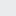

<h1>+Libras</h1>

O projeto tem como objetivo auxiliar no ensino de LIBRAS no Brasil por meio de um website, visando alcançar o maior número de pessoas possível, independentemente do nível de conhecimento prévio, utilizando vídeo aulas, imagens e exercícios para o aprendizado. Assim é possível a maior inclusão de deficiente auditivos na sociedade, já que eles são 11 milhões no Brasil e ainda assim as LIBRAS não são obrigatórias em muitos empregos ou nas escolas.

<h2>Sobre o Projeto</h2>

Libras é uma abreviação para língua brasileira de sinais, sendo difundida no brasil por volta do meio do século 19 derivada da antiga língua francesa de sinais. É uma língua que consiste na comunicação com gestos e expressões corporais, sendo utilizada principalmente para a comunicação com deficientes auditivos.

De acordo com uma pesquisa realizada pelo instituto brasileiro de geografia e estatística (IBGE), é estimado que haja aproximadamente 11 milhões de pessoas tenham deficiência auditiva no brasil, sendo 2,3 milhões desses com deficiência severa, esse número consiste em 5% da população total do país. Após um estudo do instituto locomotiva, foi constatado que 54% dos surdos são do gênero masculino e 46% do gênero feminino.

Mesmo com esse número alarmante, não há um grande incentivo ao aprendizado e ensino de libras, não sendo aplicada na maioria das escolas públicas ou requisitada no mercado de trabalho, além de muitos funcionários públicos não terem o conhecimento básico da língua. Isso gera diversas consequências para os deficientes auditivos como exclusão do sujeito da sociedade, dificuldade de acesso a serviços essenciais (saúde, segurança, etc.), dificuldade em estudo e conseguir emprego.

Por isso, a difusão da língua é muito importante para toda a sociedade, dando acessibilidade para os surdos, assim +Libras foi criado com o intuito de dar aulas de libras separadas por módulos, do mais básico até o mais avançado, também contendo um dicionário, onde é possível pesquisar termos ou palavras específicas.

<h3>Cores Utilizadas</h3>

As cores principais do Mais Libras foram selecionadas especialmente com base na teoria das cores, que argumenta que certas cores podem ter um significado ou uma sensação atribuída a elas.

<ul>
    <li> #50C878</li>
    <li> #EAEBED</li>
    <li> #006989</li>
    <li> #007090</li>
    <li> #01A7C2</li>
</ul>

O site conta com uma paleta de cor composta de tons de verde, branco e azul. O verde passa a sensação de tranquilidade e equilíbrio, assim sua função no visual é de passar um conforto para o estudante, também é comum o uso de verde em escolas, o que faz o usuário associar o Mais Libras com um ambiente de estudo.

O branco já é utilizado para dar uma limpeza ao site, complementando o verde e azul, também é utilizado na nossa logo que conta com partes brancas em seu interior. Os tons de azul trazem uma harmonia, assim como o verde, para também passar uma sensação de paz. 

<h3>Fontes Utilizadas</h3>

Lorem ipsum dolor sit amet consectetur adipisicing elit. Unde veniam excepturi, non explicabo, impedit iste a corrupti eum labore omnis natus suscipit asperiores illo, cumque dignissimos ipsum quasi sequi molestias.

